# アプリケーションフロー

## 1. メインフロー

### 1.1 文書一覧画面 (Index.vue)

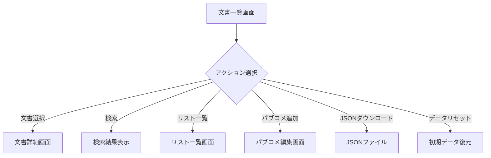

### 1.2 文書詳細画面 (Document.vue)

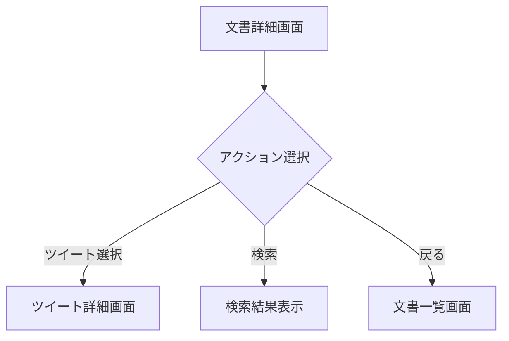

### 1.3 ツイート詳細画面 (Tweet.vue)

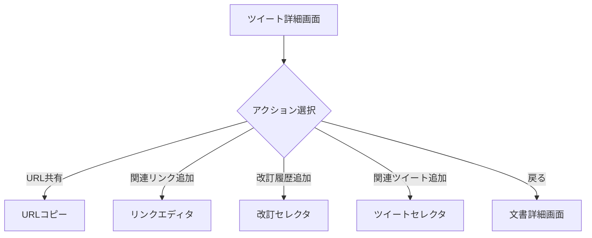

## 2. リスト管理フロー

### 2.1 リスト一覧画面 (Lists.vue)

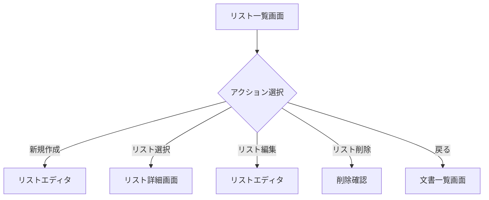

### 2.2 リスト詳細画面 (ListDetail.vue)

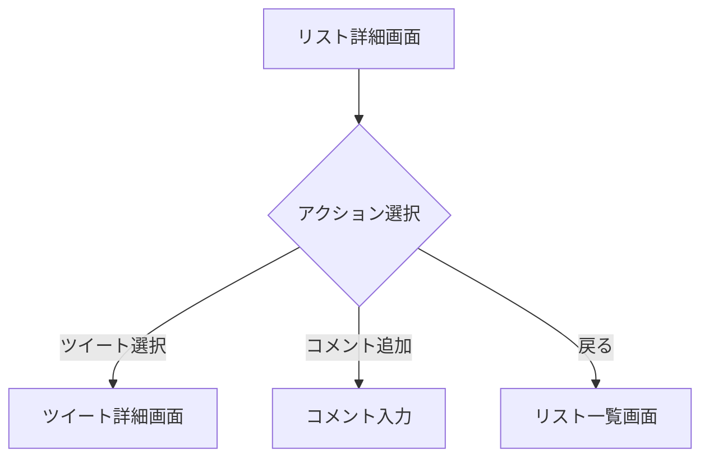

## 3. 改訂履歴フロー

### 3.1 改訂一覧画面 (RevisionPage.vue)

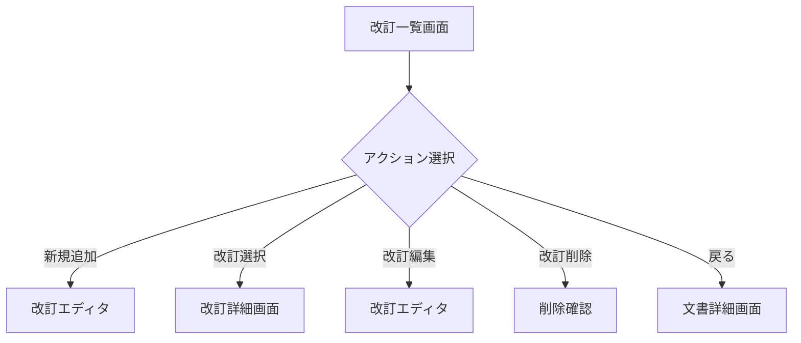

### 3.2 改訂詳細画面 (RevisionDetail.vue)

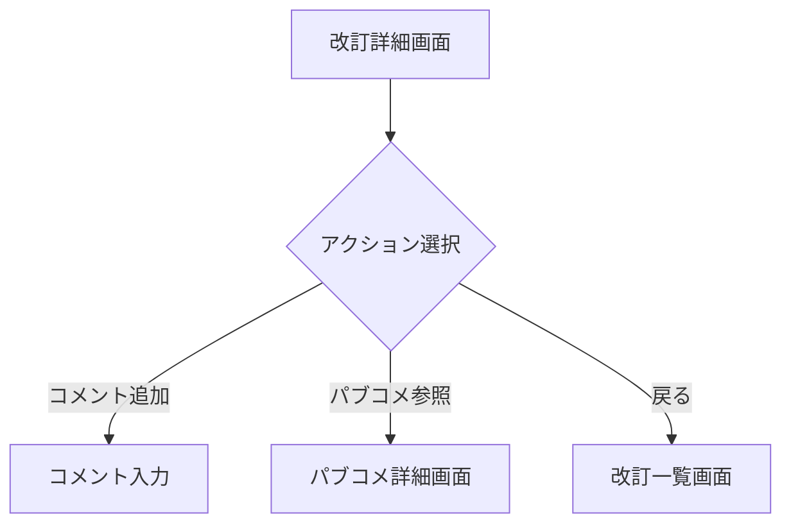

## 4. データフロー

### 4.1 ローカルストレージ

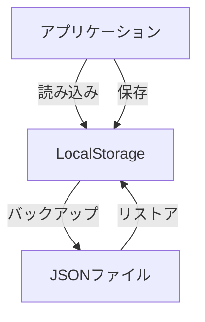

### 4.2 状態管理

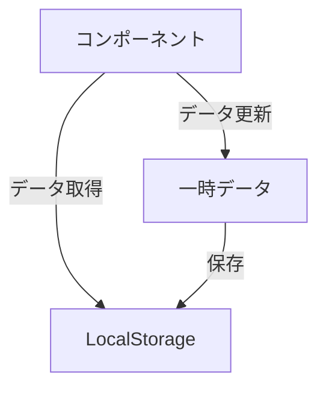

## 5. エラーハンドリング

### 5.1 データ操作エラー

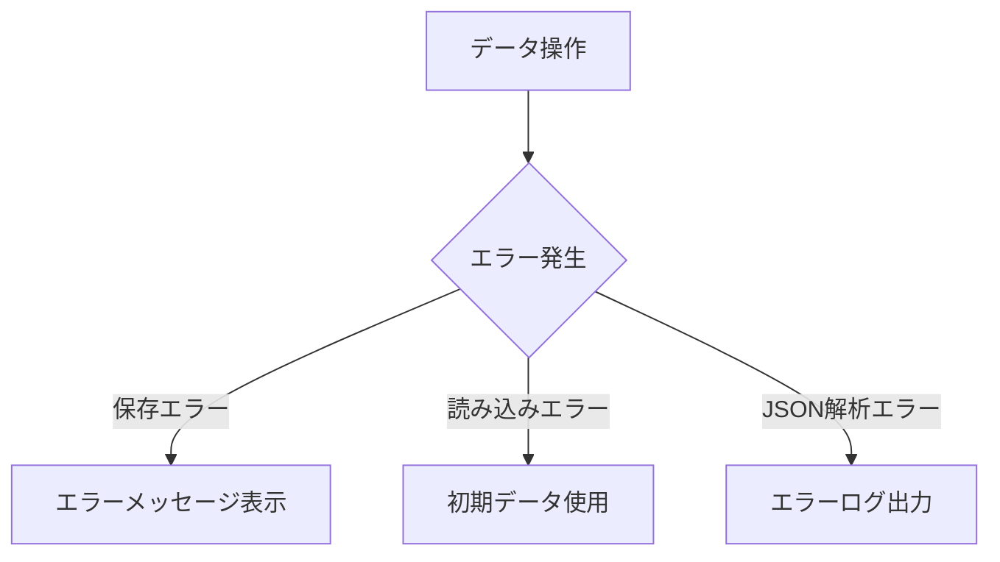

### 5.2 ナビゲーションエラー

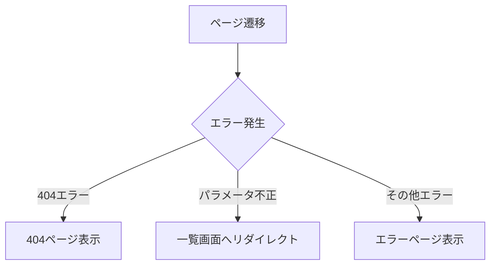

## 6. レスポンシブ対応

### 6.1 画面サイズ別レイアウト

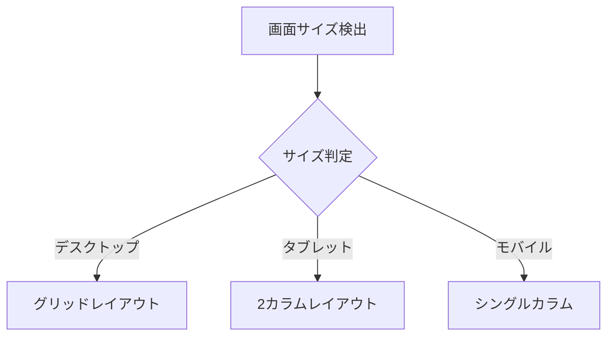

### 6.2 インタラクション

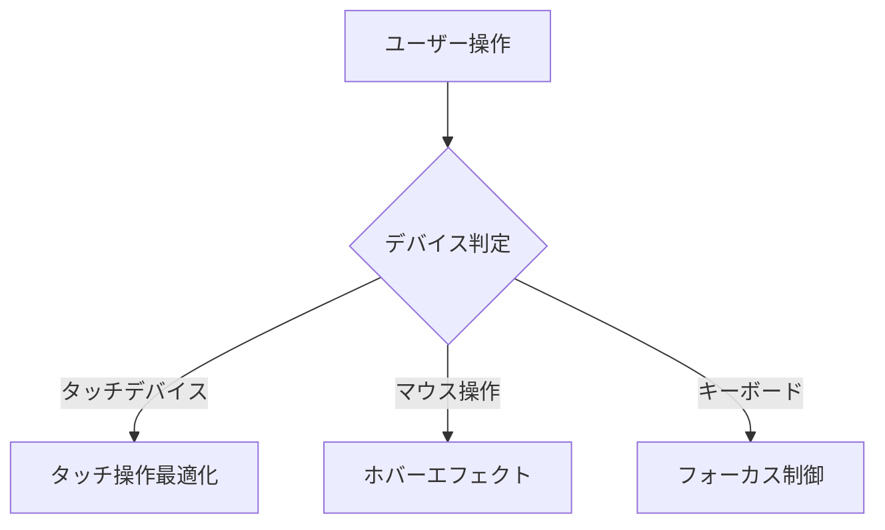